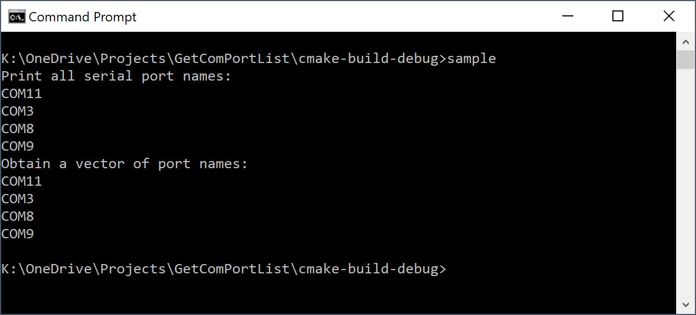

# GetComPortList

A simple C++ class for enumerating COM ports on a computer.  Useful
for embedded programming or for communication with USB-to-serial
bridge devices.




## Motivation

This C++ class provides cross-platform enumeration of serial ports
for `Windows`, `Linux` and `Mac OS X`.

## Getting Started

Uses the `C++17` standard library.


### Example Usage

Please see the `main.cpp` file for further details.  A complete
sample program is provided below.

```
#include <iostream>
#include "GetComPortList.h"

int main()
{
	std::cout << "Print all serial port names:" << std::endl;
	GetComPortList::print_serial_port_list();
	std::cout << "Obtain a vector of port names:" << std::endl;
	std::vector<std::string> lst = GetComPortList::get_list_serial_ports();
	for (const std::string& s: lst)
	{
		std::cout << s << std::endl;
	}
	return 0;

} // end
```


### Documentation

This readme file and C++ class should be easily understandable. Please feel free to contact me
if you would like to have changes made to the code.


## Authors

* **Nicholas J. Kinar (<n.kinar@usask.ca>)**
